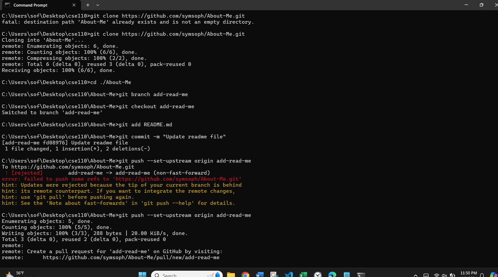
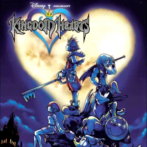

# ✨ Sofia's User Page ✨

> Here is my ~~favorite~~ photo of the week! 
>  Description of Image Screenshot of git commands via the Windows Command Prompt.

## The _Real_ MeHAha
Hello! I'm Sofia, striving to be a **game dev**, because I love all the ways the arts come together with technology to create an interactive, memorable, and enjoyable product. Really, I am chasing a career that allows me to express my creativity as an artist and musician and to think logically.  Hopefully, it's game dev but I am learning about other career paths like those in sound engineering and UI/UX design. 
> **_We shall see._**

[This game changed in my life circa 2019.](/joke.md)

### Simply a Few of My Favorite Things  
Let's `git` it! 

I _love_ to read; my favorite authors and books:
- Carmen Maria Machado
  - Her Body and Other Parties
  - In the Dream House
    - ^ She writes such good horror ^
- Madeline Miller
  - The Songe of Achilles
    - ^ Pretty prose retelling of the tale of Achilles and Patroclus ^
- Shirahama Kamome 
  - Witch Hat Atelier
    - ^ THE ART is so pretty and a great story to boot (😍 MAGIC) ^

Most Frequented Musicians in my Playlists (in no particular order)[^1]:
1. [BTS](https://www.youtube.com/watch?v=a4YwJCZRh5M)
2. [Utada Hikaru](https://www.youtube.com/watch?v=Bv7TlgwukL8)
3. [UMI](https://www.youtube.com/watch?v=jH1mO5lVkW4)
4. [Yoko Shimomura/Project Destati](https://www.youtube.com/watch?v=6JbxlYRPbZg)

[^1]: I linked my favorite songs for each artist.
<!--- So MUCH FUN ..too many songs to choose from--->

I need to `git commit` to this task list
- [x] Headings, Styling, External Links, ordered+unordered lists, task list
- [x] Quoting code+sentence
- [X] Section+relative(ex. picture) links literally
- [ ] Get a summer internship
- [ ] Graduate (and never come back)
- [ ] Have fun :)
